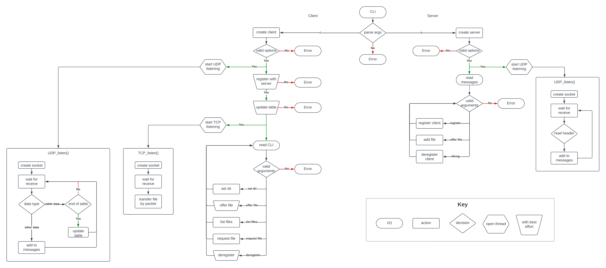
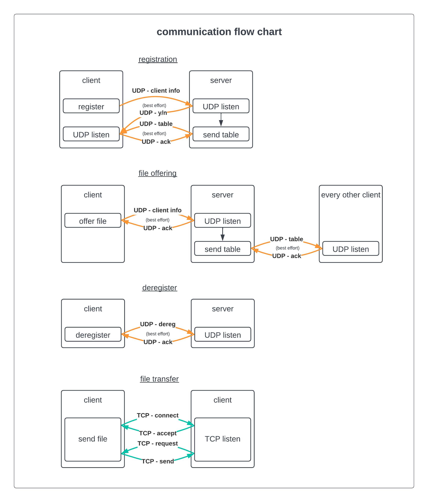
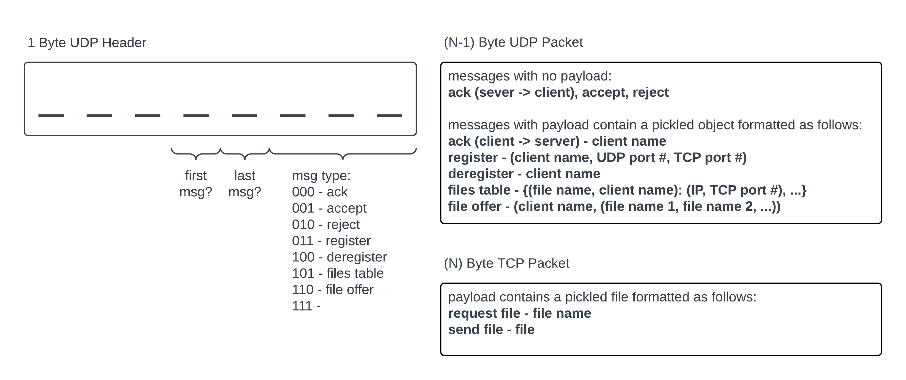
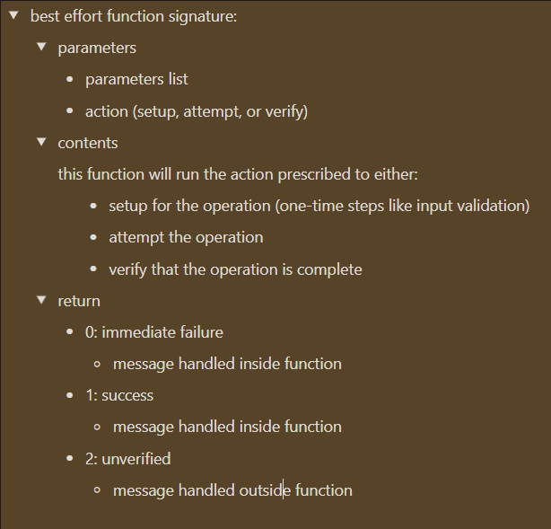
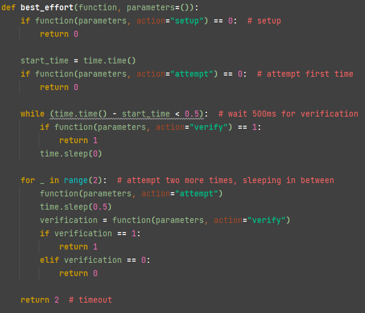

# Computer Networks - Programming Assignment 1
Matthew Modi (mem2382)

## Compilation
The program is contained within "FileApp.py".

There is no included requirements.txt, since the program uses only modules from Python's standard library.

It was written in Python 3.11, and must be executed with a Python 3.11 interpreter or newer.

### Bash Execution
_"chmod" need only be called once._

    gain execute permissions (once)     $ chmod +x FileApp
    run program (any # of times)        $ ./FileApp.py <args>

### Alternate Execution

    $ python3 FileApp.py <args>

## Functionality
Help messages are provided throughout the program's execution to guide the user.
Examples of the program's functionality are included below.

### Help Menu
    $ ./FileApp
    >>> use either:
    >>>     python3 FileApp.py -s <port>
    >>>     python3 FileApp.py -c <name> <server-ip> <server-port> <client-udp-port> <client-tcp-port>
### Startup
    $ ./FileApp -s 5000
    >>> listening...

    $ ./FileApp -c 127.0.0.1 5000 5001 6001
    >>> [Welcome, You are registered.]
    >>> [Client table updated.]
    >>> -------------------------------
    >>> Welcome to FileApp.
    >>> Commands are stated below.
    >>> Options may not contain spaces.
    >>>     setdir <dir>
    >>>     offer <filename1> ...
    >>>     list
    >>>     request <filename> <client>
    >>>     dereg
    >>> -------------------------------
    >>>
### Set Directory
    >>> setdir files
    >>> [Successfully set 'files' as the directory for searching offered files.]
    >>>
### Offer File(s)
    >>> offer file.txt
    >>> [Offer message received by server.]
    >>> [Client table updated.]
    >>>
### List File(s)
    >>> list
    FILENAME   OWNER    IP ADDRESS   TCP PORT
    file.txt   client   127.0.0.1    6001
    >>>
### View Other Clients' Files
    >>> [Client table updated.]
    >>> list
    FILENAME   OWNER     IP ADDRESS   TCP PORT
    file.txt   client    127.0.0.1    6001
    file.txt   client2   127.0.0.1    6002
    >>>
### Request File
    >>> request file.txt client2
    < Connection with client client2 established. >
    < Downloading file.txt >
    < file.txt downloaded successfully! >
    < Connection with client client2 closed >
    >>>
### Send File
    < Accepting connection request from ('127.0.0.1', 57339) >
    < Transferring file.txt >
    < file.txt transferred successfully! >
    < Connection with client closed >
    >>>
### Deregister
    >>> dereg
    >>> [You are Offline. Bye.]
    >>>

## Restrictions
All restrictions are verified during program execution. If you are in violation, you will be notified.
For clarity, they are as follows:
- Client names may be at most 32 characters.
- File names may be at most 32 characters.
- IP Addresses must be in IPv4 format.
- Port numbers must be between 1024 and 65535.
- Directory may only be set once.
- No more than 10 files may be offered at one time.
- File paths must be in set directory, not subdirectories.
- File names must not contain spaces or special characters.

## Design
My process for designing the program was to:
- List the features which needed to be implemented, for client and server.
- Create a flowchart for the communications.
- Create a flowchart for the program execution.
- Specify packet format and other metadata.
- [Translate flowcharts into pseudocode.](https://matthew-modi.notion.site/Pseudocode-3c45312c9775437ba0b3bb84683b0289)
- Write program.

## Extra Features
### Offering Flexibility
The program imposes restrictions on the lengths of client names, file names, and file offers
to simplify client to server communication and keep listings organized. However, there is no theoretical maximum
for the number of files being offered by all clients. The server sends clients new file tables in chunks,
which are reconstructed by clients before being referenced. With large numbers of files, the effectiveness
of this protocol would decrease and table updates could fail more frequently. Therefore, the recommended total
file offerings is 10.

### Multi-User Hosts
The server and client programs are designed to operate on either the same computer or separate computers.
One inconsistency which arises from this model is that if a server and client are both operating on the same computer,
the server will see and store the client's IP as the loopback IP (127.0.0.1) and pass it to all clients, some of whom
may be on other computers. This will, in turn, cause TCP connections between clients to fail since they are not
on the same computer (loopback is not sufficient). To solve this, each client filters incoming file tables and
replaces loopback IPs with its own server IP. If the client is, indeed, on the same computer as the server,
this will have no effect. If the client is on a different computer than the server, this replacement will properly
redirect the client's TCP requests to the server-hosted client.

### Best Effort Functions
There are many cases during which the program must take a "best effort" approach to completing a task.
To simplify my code, these tasks are encapsulated within a "best effort" function signature. The tasks broadly consist
of the following steps:
- Prepare for the task, verify inputs if necessary.
- Carry out an action.
- Monitor for verification up to 500ms.
- If there is none, retry twice more.

To enact these "best effort" tasks, a generic handler function is used to attempt any function as specified above.
The task (whose format is the function signature on the left) is then passed as a pointer to the
best effort handler function (on the right).

 